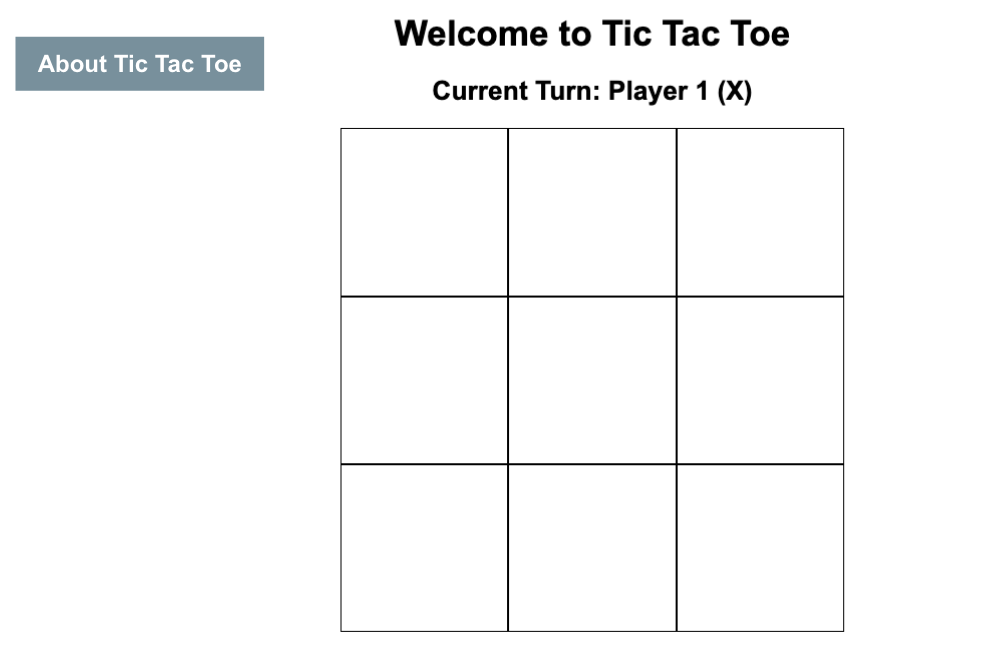
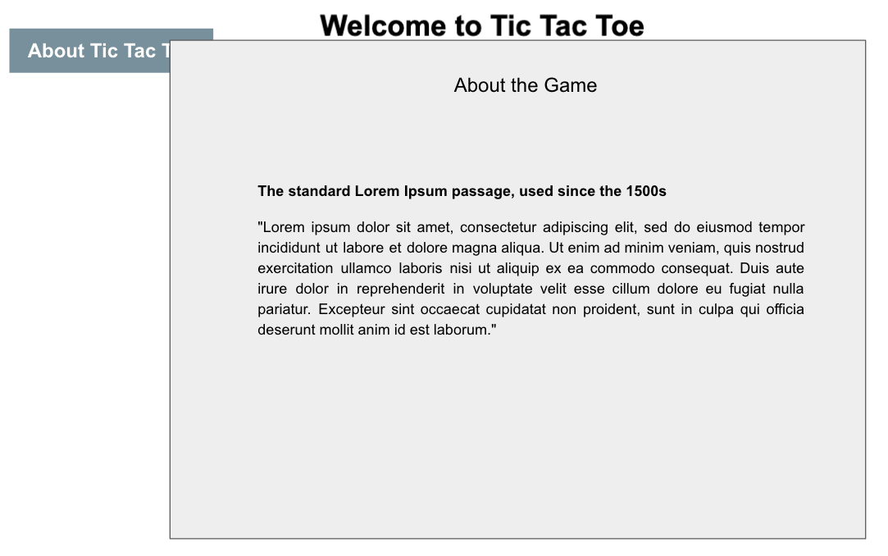

# Tic Tac Toe

## Description

A browser-based Tic Tac Toe game coded in JavaScript, HTML and CSS.

This is a link to [Google](https://google.com).

## Planning Process

### User Stories

#### MVP

- As a user, I want a browser-based interface so that I can play the game.
- As a user, I want to place my token so that I can interact with the game.
- As a user, I want the game to reach a win state so that I know who won and can play again.
- As a user, I want to keep track of placement (Not overriding another players turn).
- As a user, I want to track turns, so I don't have to keep track on my own (The placement doesn't disappear)
- As a user, I want the computer to recognize 3 icons that are the same, in a row, to be understood as a win state. (So the user doesn't have to know when they won or lost, the program tells them)
- As a user, I want a hashmark display to track where the moves go
- As a user, I want 3 win conditions, Win Lose Tie, So I know what happened as the result
- As a user, I want to be able to take turn once the other player is finished with their turn.
- As a user, I want to be able to choose whether I go first or not.
- As a user, I want to have an indication of who's turn it is.
- As a user, I want the game to pick who goes first if both players are at the same skill.
- As a user, I want the game to indicate whether I won, lost, or draw.
- As a user, I want the ability to restart the game

#### Bronze

- As a user, I want to pick what color my token is.
- As a user, I want to pick what background color I have.
- As a user, I want an alert to pop up for when I win.
- As a user, I want to be able to see a scoreboard to track how many games I have won
- As a user, I want to see a screen that tells me how the game works
- As a user, I want player that goes first to be randomly determined.
- As a user I want a visual representation of who's turn it is.
- As a user I want a visual representation of who won the game.
- As a user, I want a scoreboard to track my win-count.

#### Silver

- As a user, I want to play against AI.
- As a user, I want to be able to see how my wins compare with other users
- As a user, I want to be able to play the game with a friend.
- As a user, I want the game to store my stats even if I leave the page.
- As a user, I want there to be a rankings leaderboard.
- As a user, I want there to be different difficulty levels from the AI.

#### Gold

- As a user, I want to be able to upload my own image as my token so that I can customize the game.
- As a user, I want a profile to track my stats of how many wins, ties or loses I've had
- As a user, I want a leaderboard that compares my stats with others
- As a user, I want to be able to play against a bot
- As a user, I want cosmetic options for different styles of board.
- As a user, I want to be able to play different forms of the game, such as 3-dimensional Tic-Tac-Toe
- As a user, I want the game to have a global match-making system so that I can play against other users that are similarly-ranked

### Wireframes

#### Main View

#### About Modal

## Installation

1. Clone down the repository to your machine.
1. Open the `index.html` in the browser.
